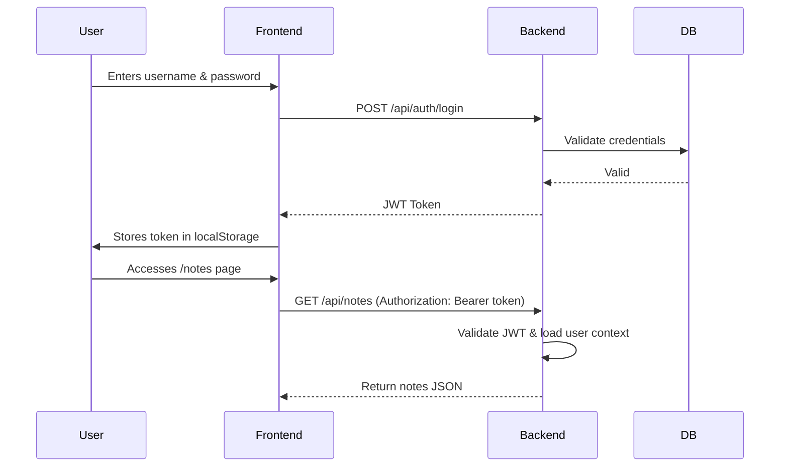

# Authentication Flow

## Description

- Authentication uses JWT tokens generated by the backend.
- Each request to protected endpoints includes the token in the Authorization header.
- Tokens are verified on every call, and user context is extracted from them.
