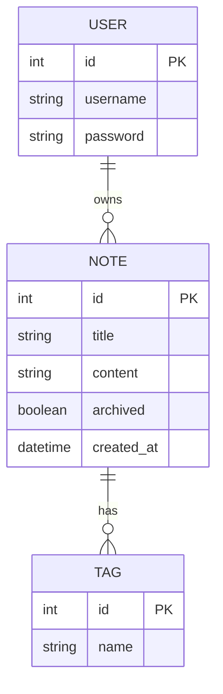

# Data Model

```mermaid
erDiagram
    USER ||--o{ NOTE : owns
    NOTE ||--o{ TAG : has

    USER {
        int id PK
        string username
        string password
    }

    NOTE {
        int id PK
        string title
        string content
        boolean archived
        datetime created_at
    }

    TAG {
        int id PK
        string name
    }
```

## Description

- A User can own multiple Notes.
- Each Note can have multiple Tags (many-to-many relation).
- Notes can be marked as archived or active.
