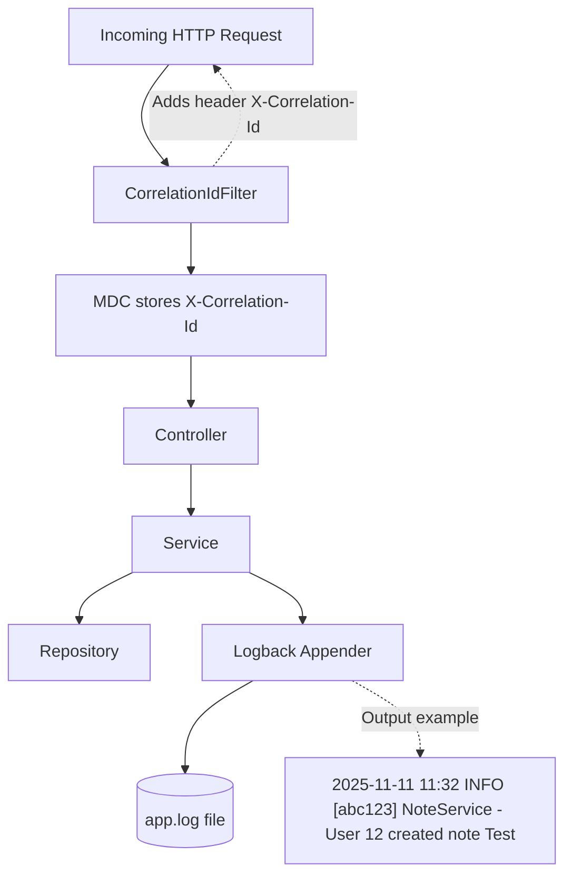

# Logging and Correlation ID Flow

## Description

- Every incoming request passes through a Correlation ID Filter.
- If the header X-Correlation-Id is not present, a new UUID is generated.
- The ID is stored in the Mapped Diagnostic Context (MDC) and included in all logs.
- Logs are formatted and persisted via Logback for traceability.
